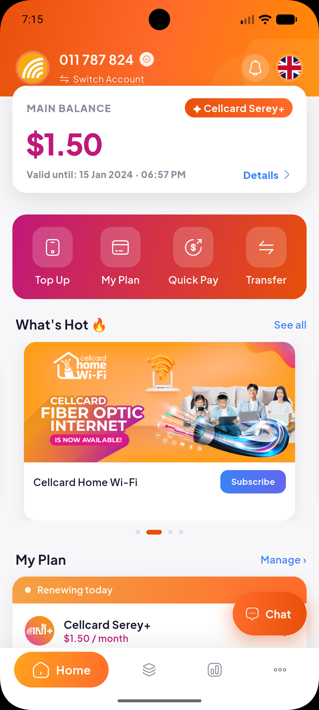
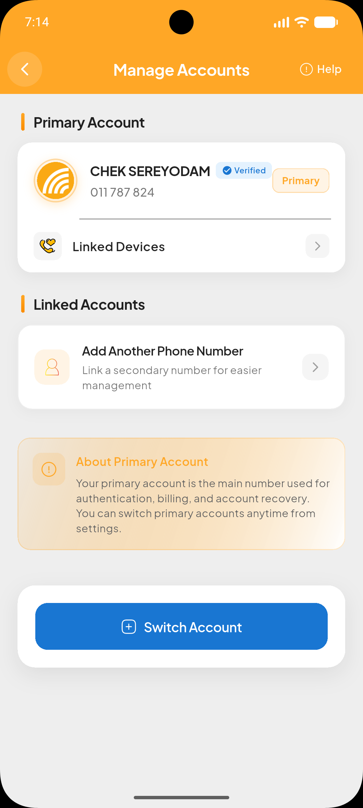
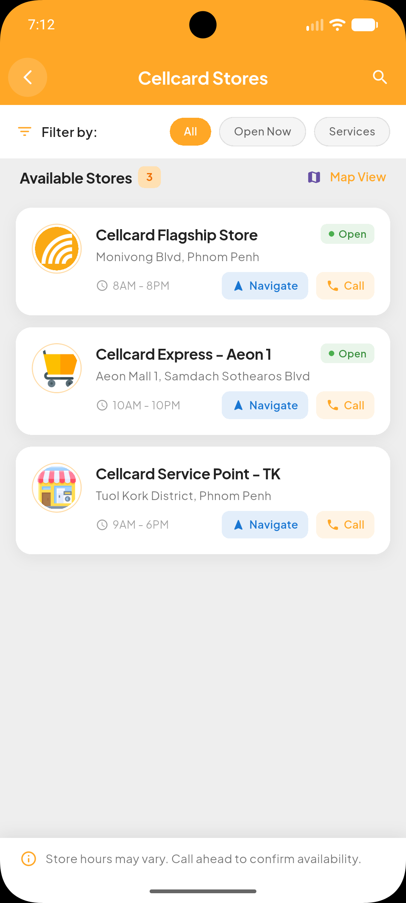
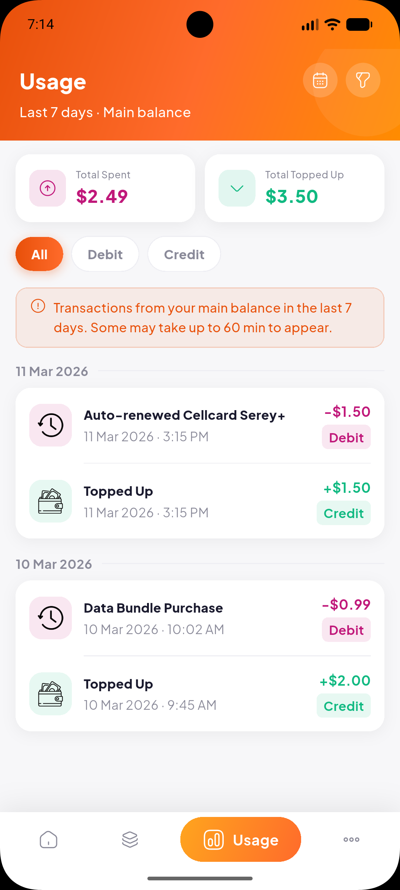
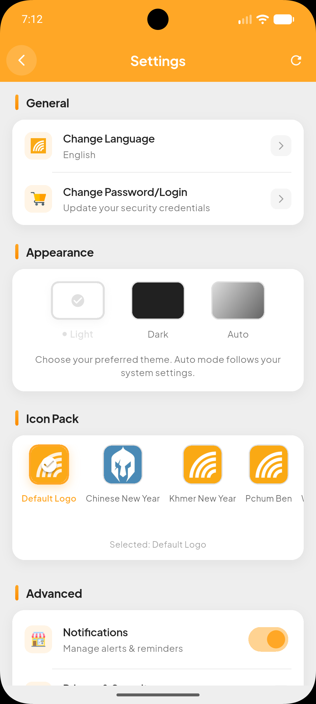
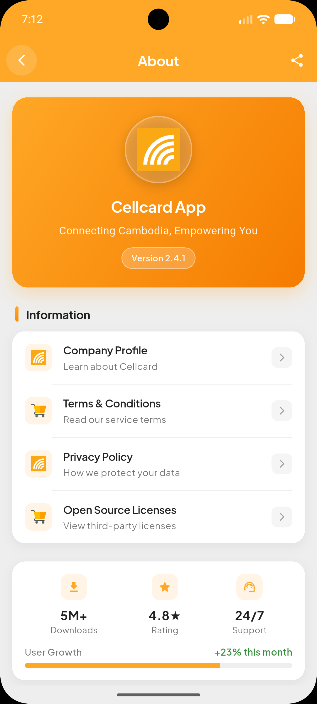

# 📱 CellCard Unofficial App – Flutter Mobile Application

<p align="center">
  
  
  
  
  
  
</p>

### 👨‍💻 Built by SereyodamChek

> ⚠️ **Disclaimer**: This is an **unofficial, community-built application** and is not affiliated with, endorsed by, or officially connected to CellCard. For official services, please visit [cellcard.com](https://www.cellcard.com.kh).

---

## 📌 About This Project

**CellCard Unofficial App** is a **Flutter-based mobile application** designed to provide CellCard users with a clean, intuitive interface for managing mobile services, checking balances, purchasing packages, and exploring available offers.

Built with modern Flutter practices, this project demonstrates cross-platform development, responsive UI design, and seamless user experience — all while serving as a learning resource for telecom app development.

---

## 🚀 Key Features

* 📊 **Balance & Usage Tracker** – View data, call & SMS usage in real-time
* 🛒 **Package Store** – Browse & purchase data/call packages easily
* 👤 **Account Management** – Profile info, transaction history & settings
* ⚙️ **Quick Settings** – Toggle notifications, language & theme preferences
* 📱 **Fully Cross-Platform** – Android, iOS, Web, Windows, macOS, Linux
* 🎨 **Modern UI** – Clean design with smooth animations & adaptive layouts

---

## 🛠️ Tech Stack

* 💙 **Flutter (Dart)** – Cross-platform UI framework
* 🎯 **Material Design 3** – Modern, adaptive UI components
* 🧭 **Navigation** – `[GoRouter / AutoRoute / Navigator 2.0]`
* 📊 **State Management** – `[Riverpod / Provider / BLoC / GetX]`
* 🗃️ **Local Storage** – `[Shared Preferences / Hive / SQLite]`
* 🌐 **Networking** – `[Dio / http]` for API communication *(if implemented)*

---

## 📂 Project Structure

```
/CellCard_Unofficial_App
│
├── lib/                     → Main application logic
│   ├── main.dart            → App entry point & initialization
│   ├── core/                → Constants, themes, routing, utilities
│   ├── features/            → Feature modules (home, account, store, settings, about)
│   └── shared/              → Reusable widgets, buttons, dialogs, inputs
│
├── home.png                 → Home screen preview
├── account.png              → Account screen preview
├── store.png                → Store screen preview
├── usage.png                → Usage screen preview
├── setting.png              → Settings screen preview
├── about.png                → About screen preview
│
├── /android /ios /web /windows /macos /linux → Platform-specific configs
├── /test                    → Unit & widget tests
├── pubspec.yaml             → Dependencies & project metadata
└── README.md                → Documentation
```

---

## ⚙️ Getting Started

### 1. Install Flutter

👉 [https://docs.flutter.dev/get-started/install](https://docs.flutter.dev/get-started/install)

### 2. Clone the repository

```bash
git clone https://github.com/SereyodamChek/CellCard_Unofficial_App.git
cd CellCard_Unofficial_App
```

### 3. Install dependencies

```bash
flutter pub get
```

### 4. Run the app

```bash
flutter run
```

---

## ▶️ Run on Specific Platforms

```bash
flutter run -d chrome      # Web
flutter run -d android     # Android
flutter run -d ios         # iOS (macOS required)
flutter run -d windows     # Windows Desktop
flutter run -d macos       # macOS Desktop
flutter run -d linux       # Linux Desktop
```

---

## 🎯 Purpose

* Practice **Flutter mobile development** with real-world UI patterns
* Learn **telecom app features**: balance checks, package purchases, usage tracking
* Build a **production-ready mockup** for portfolio showcase
* Explore **cross-platform development** with a single codebase
* Prepare for backend API integration & authentication flows

---

## 📈 Future Improvements

* 🔐 Mock authentication & OTP verification flow
* 🌐 Integrate real CellCard API for live balance & transactions
* 🔔 Push notifications for package expiry & promotions
* 🌍 Multi-language support (Khmer / English)
* 💳 In-app payment simulation with ABA PayWay / KHQR
* 📊 Advanced usage analytics with charts & insights
* 🎨 Custom theme builder & accessibility options

---

## ⚠️ Notes

* This is a **frontend/UI-focused educational project**
* All data is **mock/static** — no real CellCard account connections
* Optimized for learning, portfolio display, and interview preparation
* Feel free to fork, study, and adapt for your own telecom or utility app projects!

---

## 📫 Contact

**SereyodamChek (Dom)**  
* GitHub: [https://github.com/SereyodamChek](https://github.com/SereyodamChek)  
* Email: [sereyodamc011@gmail.com](mailto:sereyodamc011@gmail.com)  
* 🌐 Portfolio: [www.cheksereyodam.site] 

🐛 [Report an Issue](https://github.com/SereyodamChek/CellCard_Unofficial_App/issues)  
💡 [Request a Feature](https://github.com/SereyodamChek/CellCard_Unofficial_App/issues)

---

⭐ *Building useful mobile experiences through clean Flutter code — one widget at a time.* 📱💙
```

